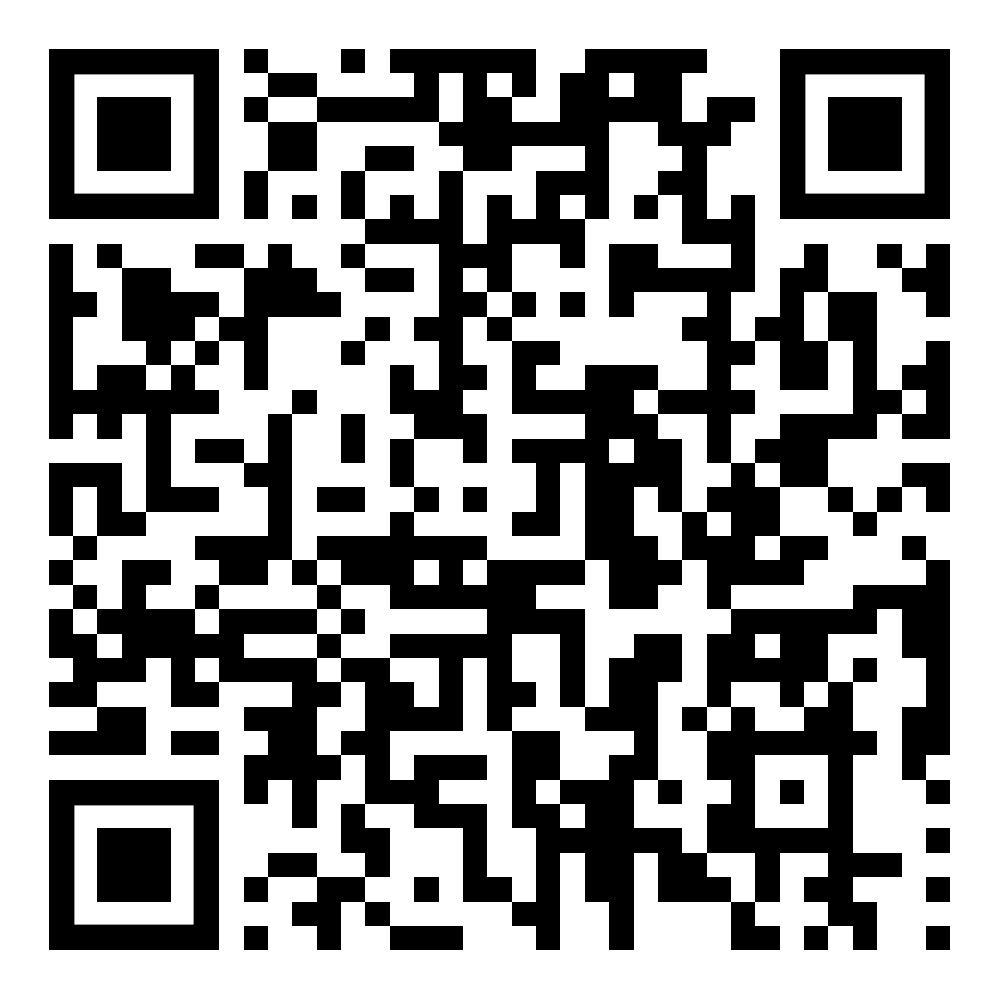

# redShop NDS

**Nintendo DS/GBA game downloader over Wi-Fi. No PC needed.**

Browse and download 99+ NDS/GBA titles directly to your SD card, straight from the 3DS HOME Menu.
---

## Features

- Browse 99+ NDS/GBA titles
- Direct download to SD card
- Resume support for large files
- Dual-screen interface
- 10 Languages (EN,ES,DE,FR,IT,NL,RU,SR,PT,PL)

---

## Requirements

- 3DS / 2DS with **Luma3DS** custom firmware
- NDS Forwarder Generator from Universal Updater or Twilight Menu++
- Wi-Fi connection
- SD card with sufficient free space

---

## Installation

1. Download the latest .cia (or simply scan the QR code with **FBI** remote install)
2. Copy it to your SD card
3. Install with **FBI**
4. Launch from the 3DS HOME Menu

*You can add your nds games to the 3ds home menu by using NDS Forwarder Generator from Universal Updater or use Twilight Menu++

---

## Usage

| Button | Action |
|--------|--------|
| D-Pad | Navigate game list |
| A | Download selected game |
| B | Cancel / Exit |

---

## Known Issues

- Large files can take a long time to download depending on your connection
- Connection drops may require a full restart

---

## Support

If this helped you play childhood games again, consider supporting:

**BTC**: bc1qhhsl9370xuyjxz0r4t9uazdpgkqrrwputm7ls0
